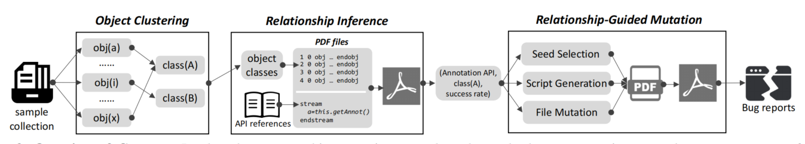

Cooper: Testing the Binding Code of Scripting Languages with Cooperative Mutation
====================================================================================
Cooper utilize cooperative mutation to test the binding
code of scripting languages to find memory-safe issues. Cooperative mutation
simultaneously modifies the script code and the related document objects to explore
various code paths of the binding code. To support cooperative mutation, we infer
the relationship between script code and document objects to guide the two-dimensional mutation. 
We applied our tool Cooper
on three popular commercial software, Adobe Acrobat, Foxit Reader and Microsoft Word.
Cooper detected 134 previously unknown bugs, which resulted in [33 CVE entries](cve-list.md) and
22K bug bounties. Cooper has three components:

* **Object Clustering**: In the begining, Cooper parses the given sample documents to
  extract native objects. To reduce the object search space, Cooper categorizes objects
  into different classes based on their attributes.
* **Relationship Inference**: Then, Cooper infer the relationship between object classes
  and Api groups. Specifically, it produces a large number of documents by combining
  different object classes and API groups, and records the execution results of the
  embedded scripts. Based on the success rate of the script execution and the
  distribution of object classes, Cooper infers the relationship between Api groups
  and object classes.
* **Relatinship-Guided Mutation**: At end, Cooper leverages the inferred relationship
  to guide the object selection, script generation and object mutation. We also design
  several cooperative mutation strategies.
  
The overview of Cooper is illustrated by the diagram below.
<p align="center">

</p>

For more details, please check [our paper](https://huhong789.github.io/papers/xu:cooper.pdf) published in the 29th Annual Network and Distributed System Security Symposium ([NDSS 2022](https://www.ndss-symposium.org/ndss2022/)).

## Installation & Run

#### Platform
- Windows10 64bit
- Python2

#### Prerequisites
- [PyWin32](https://pypi.org/project/pywin32/), `pip install pywin32`
- [Adobe Acrobat Reader (32bit, English version)](https://www.adobe.com/acrobat/pdf-reader.html), 
  install in the default directory.
- [Microsoft Word (32bit, English version)](https://www.microsoft.com/en-us/download/details.aspx?id=51791),
  install it in the default directory.

#### Collecting PDF/Word samples
You need to prepare some PDF (Word) samples and place them in a folder which will be used as `sample_dir`. 
The number of PDF (Word) samples should be between 10,000 to 20,000. 
We have prepared 200 PDF samples in [DropBox](https://www.dropbox.com/sh/gpqvhqghutosg52/AABmQBJ6eWtABahgVQunfZRga?dl=0),
and 214 word samples in [DropBox](https://www.dropbox.com/sh/88c1arv24qnxrv7/AACAXpPQTvQWNsOlnPNB6GEua?dl=0).
You can test with these small samples, but for better results, use more samples.

#### Usage

```
$ python PdfSolution.py/WordSolution.py <sample_dir> <data_dir> <output_dir> <generate_cnt>
  
  <sample_dir>:   the absolute path of raw pdf samples folder
  <data_dir>:     the absolute path for mid data folder
  <output_dir>:   the absolute path for folder storing generated samples
  <generate_cnt>: the amount how many input Cooper will generate
```


## Authors

* Peng Xu <xupeng_1231@126.com>

* Yanhao Wang <wangyanhao136@gmail.com>

* Hong Hu <honghu@psu.edu>

* Purui Su <purui@iscas.ac.cn>

## Publications
```
Cooper: Testing the Binding Code of Scripting Languages with Cooperative Mutation

@inproceedings{xu:cooper,
  title        = {{Cooper: Testing the Binding Code of Scripting Languages with Cooperative Mutation (To Appear)}},
  author       = {Peng Xu and Yanhao Wang and Hong Hu and Purui Su},
  booktitle    = {Proceedings of the 29th Annual Network and Distributed System Security Symposium (NDSS 2022)},
  month        = {feb # {--} # mar},
  year         = {2022},
  address      = {San Diego, CA},
}
```
